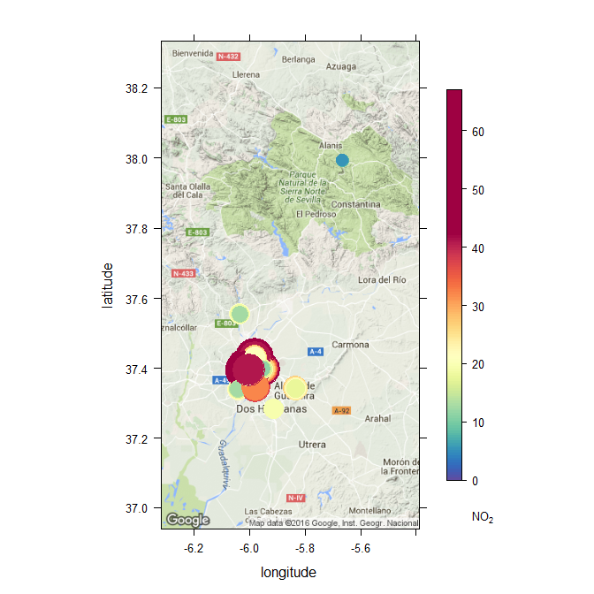

```{r echo=FALSE}
library(knitr)
opts_knit$set(root.dir=normalizePath('../'))
opts_chunk$set(warning = FALSE, message = FALSE)
opts_chunk$set(fig.path = "Sevilla_2015_figuras/", fig.show="hide")
```

```{r}
library(aire)
```

# Download data

```{r eval=FALSE}
se2015 <- get_daily_data(province = "se", from = "2015-01-01", to = "2015-12-31")
# NB: downloading a whole year takes a while... ca. 20 minutes

save(se2015, file = "data/se2015.rda")

```


# Load data

```{r}
load("data/se2015.rda")
head(se2015)
```


# Now analyse with `openair` package

```{r}
library(openair)
```


## summaryPlot

```{r summaryPlot_SO2}

summaryPlot(se2015, pollutant = "SO2")
```


```{r summaryPlot_O3}
summaryPlot(se2015, pollutant = "O3")
```


```{r summaryPlot_Torneo}
summaryPlot(se2015[se2015$site == "TORNEO", ])
```


## timePlot

```{r timePlot}
timePlot(se2015[se2015$site == "TORNEO", ], pollutant = c("SO2", "NO2", "O3"))
```


## calendarPlot

```{r calendarPlot}
calendarPlot(se2015[se2015$site == "TORNEO", ], pollutant = "O3")
```


## GoogleMapsPlot

Let's map data for e.g. 2015-05-08. First we download the data, and merge it with info on stations location:

```{r}
may8 <- get_daily_data("2015-05-08", province = "se")
data(stations)
may8sp <- merge(may8, stations[, "site"], by = "site", all.x = TRUE)
```

Now make the map:

```{r map, eval=FALSE}
GoogleMapsPlot(may8sp, pollutant = "NO2")  # experimental yet, may give problems
```

