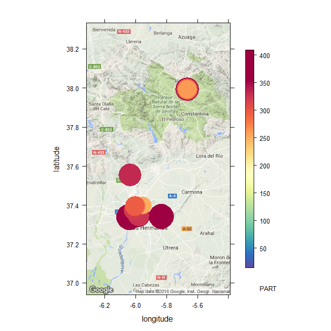

```{r echo=FALSE}
library(knitr)
opts_knit$set(root.dir=normalizePath('../'))
opts_chunk$set(warning = FALSE, message = FALSE)
opts_chunk$set(fig.path = "nubepolvo_figuras/", fig.show="hide")
```


Entre los días 20 y 22 de Febrero de 2016 ha habido una nube de polvo sahariano sobre la Península, que se ha dejado notar también en Sevilla (http://www.abc.es/sociedad/abci-medio-ambiente-nube-polvo-sahariano-dispara-contaminacion-aire-particulas-toda-peninsula-201602231715_noticia.html).

Vamos a utilizar nuestro paquete [`aire`](https://github.com/SevillaR/aire) para analizar la calidad del aire (más concretamente la concentración de partículas) en la última semana.


Primero cargamos el paquete:

```{r}
library(aire)
```


Ahora descargamos los datos de la última semana para la provincia de Sevilla:

```{r}
datos <- get_daily_data(province = "se", from = "2016-02-15", to = "2016-02-23")
```


Y los analizamos con el paquete `openair`:

```{r}
library(openair)
```


Con la función `summaryPlot` podemos inspeccionar los datos:

```{r summaryPlot}
summaryPlot(datos, pollutant = "PART", period = "months")
```


La función `timePlot` nos dibuja la serie temporal más claramente:

```{r timePlot}
timePlot(datos, pollutant = "PART", type = "site")
```


Vemos que el pico de contaminación por partículas se produjo entre el 20 y 22 de Febrero.


También podemos hacer un `calendarPlot`:

```{r calendarPlot}
calendarPlot(datos, pollutant = "PART")
```


Este es el mapa de la concentración de partículas por estaciones para el día de mayor contaminación:

```{r}
datos.21 <- get_daily_data("2016-02-21", "se")
data(stations)
datos.21.sp <- merge(datos.21, stations[, "site"], by = "site", all.x = TRUE)
```

Now make the map:

```{r map, echo=FALSE}
GoogleMapsPlot(datos.21.sp, pollutant = "PART")  
```

